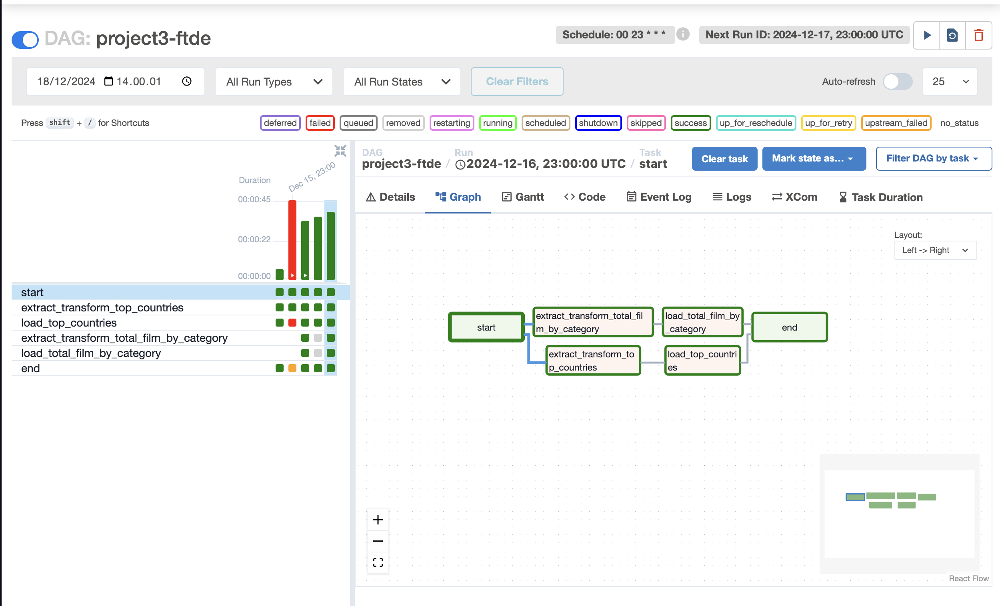
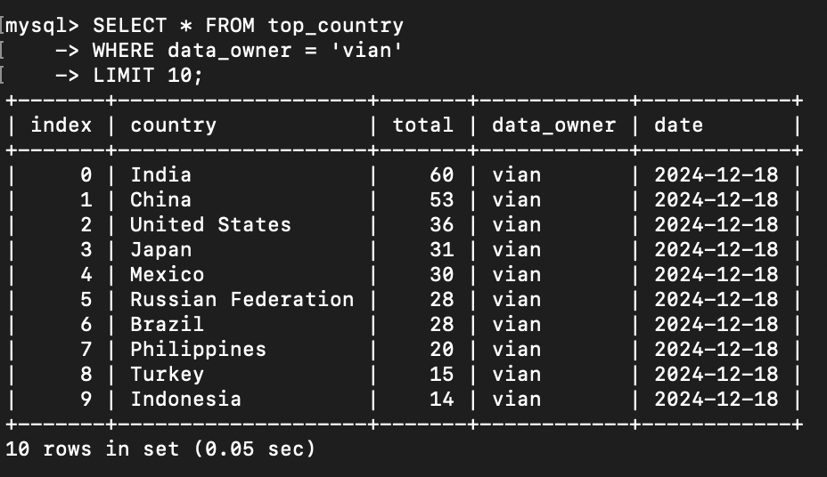
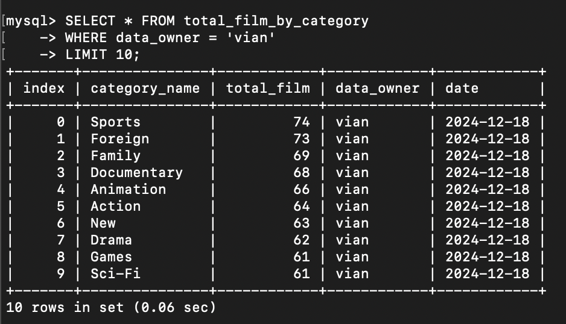

# Batch Processing Using Airflow and Spark
The project described above outlines a robust setup for batch processing workflows using Apache Airflow and Apache Spark within a unified Dockerized environment. Here's a concise summary of the key features and implementation details:

## Overview:
This project was created to support the product team’s need for integrating data from the company's Data Warehouse (DWH) to their product via an API. The key use cases for this integration are:
- **Top Country Based on User**: To provide product teams with insights on user demographics by country, enabling better regional targeting and decision-making.
- **Total Film Based on Category**: To offer a comprehensive view of the film catalog, categorized by genre, allowing the product team to refine content offerings and improve user experience.
The goal of this project is to streamline the data flow from the Data Warehouse to the product team’s platform, ensuring that the product has access to real-time, structured data, empowering them to drive user engagement and content strategy based on accurate, actionable insights.

## Key Features
1. **End-to-End Data Pipeline**: Extracts raw data, processes it with Spark, and loads the results into a MySQL database for further analysis.
2. **Airflow Orchestration**: Automates data workflows, scheduling, and monitoring with Airflow.
3. **Spark Data Transformation**: Uses Spark to handle SQL-like data transformations and optimizations at scale.
4. **Dockerized Environment**: Airflow and Spark run together in a single container for easy deployment and scalability.
5. **Database Connectivity**: Airflow manages secure database connections for data extraction (PostgreSQL) and loading (MySQL/TiDB).

## Technology Used
1. **Apache Spark**:
    - Handles the ETL (Extract, Transform, Load) process for rental data.
    - Outputs the transformed data in Parquet format for efficient storage.
2. **Apache Airflow**:
    - Orchestrates the overall workflow, ensuring seamless execution between Spark and other components.
3. **Pandas**:
    - Reads the Parquet file generated by Spark for further data manipulation or analysis.
    - Communicates with TiDB via an API.
4. **TiDB**:
    - Acts as the database for storing and retrieving processed data.

## Data Flow Overview:
- Raw rental data → Spark (ETL) → Parquet file → Pandas → API → TiDB.

## Setup Instructions:
1. **Clone the Repository**:
Clone the GitHub repository to get started. Alternatively, you can create your own project folder.
    ``` bash
    git clone https://github.com/Mafarasya/batch-processing-using-apache-airflow-and-spark.git
    cd batch-processing-using-apache-airflow-and-spark
    ```
2. **Dockerfile Creation**:
The `Dockerfile` defines the base image for the container and installs necessary dependencies like Java, Spark, and Airflow.
3. **Environment Variables (.env)**:
The `.env` file holds important configurations like PostgreSQL credentials, Airflow settings, and other environment-specific values.
4. **Docker Compose Setup**:
The `docker-compose.yaml` file defines the services (Airflow, Spark, PostgreSQL) and their relationships, ensuring a seamless connection between them. It sets up multiple services like the Spark master and worker, Airflow webserver, scheduler, and more.

## Outcome
- By combining Apache Airflow for orchestration and Apache Spark for processing, this project allows efficient batch processing of data in a scalable and automated manner. The Dockerized setup makes it easy to deploy the entire system with minimal configuration.

## Results:
- **Airflow**

- **Top Country**

- **Total Film by Country**


### References:
**Ref**: 
- https://blog.devgenius.io/how-to-install-apache-airflow-apache-spark-in-a-single-docker-container-1fa4f6fba3c7
- https://github.com/MSinggihP/airflow-docker-spark